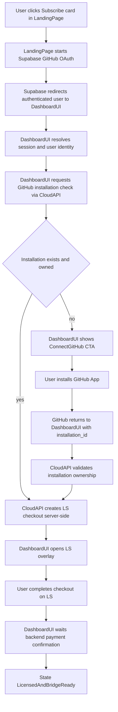
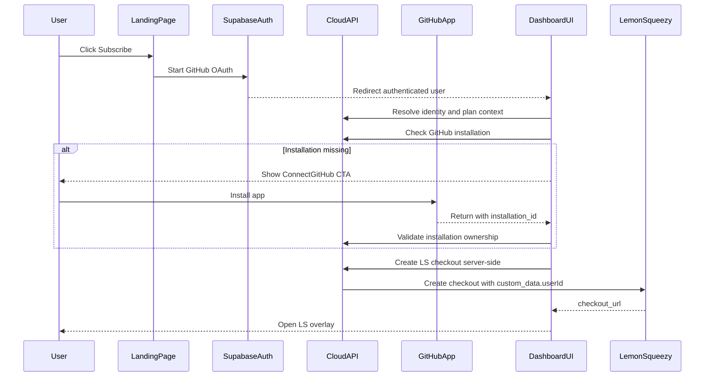

# Fase 1 - Landing-first Intent, Identity, Checkout Bootstrap

## 1) Context & Non-Negotiables

Questa fase definisce il flusso enterprise-grade a frizione minima con vincolo architetturale bloccante:

- **LandingPage** e **DashboardUI** sono due contesti distinti.
- L'entrypoint commerciale e` in **LandingPage**, non in Dashboard.
- Il trigger iniziale e` sempre:
  - `User->>Frontend: Click Subscribe`
  - con `participant Frontend as LandingPage`
  - e `participant Dashboard as DashboardUI` solo dopo redirect auth.

Obiettivo operativo:
1. Click card prezzo in LandingPage.
2. OAuth GitHub via Supabase.
3. Verifica/bridge GitHub App.
4. Atterraggio DashboardUI in stato "ready".
5. Apertura overlay LemonSqueezy con checkout creato server-side.

Out of scope:
- CLI auth (`/api/v1/link`) per questo percorso.
- Dettagli deep di provisioning tenant (`provision-stream`).
- Lifecycle billing post-primo acquisto (renew/cancel/refund nelle fasi successive).

## 2) Landing-first Action-Oriented Flow

## 3) Sequence: LandingPage -> DashboardUI

## 4) State Machine minima (Phase 1)

Stati canonici:
- `anonymous`: nessuna sessione utente valida.
- `authenticated`: sessione Supabase valida, utente risolto.
- `bridge_missing`: nessuna installazione GitHub valida per l'utente.
- `bridge_ready`: installazione validata lato server.
- `checkout_created`: checkout LS emesso server-side.
- `payment_pending`: overlay aperto, conferma webhook in attesa.
- `licensed_ready`: pagamento confermato lato backend, utente pronto.

Ownership transizioni:
- Frontend richiede transizioni.
- Backend valida e commit.
- Transizioni da pagamento sono backend-only (webhook/reconciliation).

## 5) Implementation Guardrails (Anti-Ambiguity)

### Divieti espliciti
- Vietato descrivere "Click Subscribe" come azione iniziale in Dashboard.
- Vietato aprire checkout LS senza gate `bridge_ready`.
- Vietato mappare licenza utente usando email come chiave primaria.
- Vietato fidarsi di `userId` passato dal client senza bind a sessione server.

### Regole vincolanti
- Checkout LS solo **server-side**.
- `custom_data.userId` valorizzato dal backend dal contesto auth.
- `installation_id` sempre validato server-side come appartenente all'utente.
- DashboardUI visualizza stati derivati da backend, non inferiti localmente.

### Terminologia canonica
Usare sempre e solo:
- `LandingPage`
- `DashboardUI`
- `CloudAPI`
- `SupabaseAuth`
- `GitHubApp`
- `LemonSqueezy`

## 6) Security & Integrity Controls

- Validazione sessione Supabase server-side su ogni endpoint critico.
- Verify ownership su `installation_id` prima di sbloccare checkout.
- Allowlist server-side di `variant_id`/`plan_id`.
- Correlation id e audit log per step (`user_id`, `installation_id`, `checkout_id`).
- Idempotenza prevista per eventi pagamento (fase webhook).

## 7) UX Rules (Minimal Friction)

- Se `bridge_missing`: un solo CTA chiaro `Connect GitHub`.
- Dopo ritorno installazione: auto-resume e auto-open checkout.
- Se checkout gia` aperto ma non finalizzato: tentativo di resume sessione.
- Copy deterministico di stato:
  - `Authenticating...`
  - `Checking GitHub access...`
  - `Preparing secure checkout...`
  - `Waiting payment confirmation...`

## 8) QA / Acceptance Checklist

- [ ] Il primo trigger e` documentato solo in LandingPage (`Click Subscribe`).
- [ ] Nessun diagramma mostra Dashboard come entrypoint commerciale.
- [ ] Il checkout LS non si apre in assenza bridge GitHub valido.
- [ ] Ogni checkout e` mappato a un unico utente via `custom_data.userId`.
- [ ] La transizione a `licensed_ready` avviene solo dopo conferma backend.
- [ ] Nomenclatura diagrammi e testo coerente con standard canonico.

## 9) Done Definition

- Documento full rewrite completato in modalita` Landing-first.
- Ambiguita` Landing/Dashboard eliminate.
- Diagrammi e testo coerenti con il vincolo architetturale bloccante.

## 10) Staging Runbook (Billing Stability)

- Prima di ogni UAT su staging:
  - verificare che `LS_API_KEY`, `LS_STORE_ID`, `LS_VARIANT_*`, `LS_WEBHOOK_SECRET` siano coerenti nello stesso environment Vercel.
  - verificare che webhook LemonSqueezy punti al deployment corretto e che la firma sia allineata 1:1.
- Se prodotti/varianti LS vengono cambiati, considerare non riusabili i checkout pendenti creati prima del cambio.
- Un checkout pendente e` valido solo se:
  - URL checkout sicura (`https://*.lemonsqueezy.com`);
  - contesto coerente (`store`, `variant`, `env mode`);
  - eta` entro la finestra di riuso configurata.
- In caso di mismatch/stale, il flusso deve rigenerare checkout server-side (`create-checkout`) invece di riaprire URL storiche.

## 11) Regression Gates (Preview Sign-off)

- Caso A (happy path):
  - bridge valido -> `bridge_ready`;
  - checkout creato o riusato in modo coerente;
  - overlay LS si apre senza 404.
- Caso B (bridge stale):
  - `installation_id` storico non valido non deve produrre errore rosso bloccante;
  - API deve degradare a `bridge_missing` con recovery UX (`Connect GitHub` / `Configure`).
- Caso C (checkout stale):
  - `checkout-status` deve restituire `checkoutUrl: null` quando URL non sicura, stale o context-mismatch;
  - il client deve chiamare `create-checkout` con `forceNew=true`.
- Caso D (webhook stabilita` stato):
  - evento pagamento valido porta a `licensed_ready`;
  - eventi successivi non terminali non devono regredire lo stato da `licensed_ready`.

- Evidenze minime da raccogliere nei log preview:
  - presenza `POST /api/v1/licensing/create-checkout` nei casi recovery;
  - assenza loop con sole chiamate `checkout-status`;
  - presenza log strutturati con `correlationId` e reason di fallback (`checkoutRecoveryReasons` o `staleInstallationId`);
  - webhook con `eventKey` e `preventedRegression` valorizzati quando applicabile.

- Stato esecuzione gate (code-level, pre-UAT):
  - A: PASS (bridge + checkout path protetti da fallback e validazioni server/client).
  - B: PASS (stale installation degrada a `bridge_missing` senza hard fail).
  - C: PASS (`checkout-status` filtra URL stale/mismatch e forza recovery).
  - D: PASS (webhook preserva `licensed_ready` ed evita regressioni di stato).

## 12) Multi-Licenza per Tenant (Stesso Piano)

- La chiave logica intent/licenza e` `tenant_id + plan_code` (non piu` `user_id + plan_code`).
- Uno stesso utente puo` avere lo stesso piano su tenant diversi.
- Sullo stesso tenant+piano, licenza gia` attiva = blocco acquisto duplicato (`ERR_TENANT_PLAN_ALREADY_LICENSED`).
- `tenant_id` deve essere propagato nel flusso subscribe (`checkout-status`, `bridge-status`, `create-checkout`) e nel `custom_data` webhook.
- In assenza di `tenant_id` esplicito, il backend puo` tentare risoluzione da `installation_id`; se ambiguo, il client deve richiedere selezione tenant.

- Gate regressione multi-licenza:
  - A: stesso utente+stesso piano+tenant diversi -> consentiti checkout distinti.
  - B: stesso utente+stesso piano+stesso tenant con stato `licensed_ready` -> blocco con `ERR_TENANT_PLAN_ALREADY_LICENSED`.
  - C: stale checkout per tenant -> nessun riuso URL se context mismatch/stale.
  - D: webhook success su checkout con `tenantId` -> upsert su `tenant_id+plan_code`, transizione `licensed_ready`.
  - E: nessuna regressione bridge/checkout flow precedente (fallback bridge missing e forceNew recovery).

## 13) Buy-Then-Create con Decisione in DopaComponent

- Modello operativo enterprise aggiornato:
  - pagamento confermato senza tenant assegnato -> stato `licensed_ready_unassigned`;
  - tenant associato dopo provisioning -> stato `licensed_ready_assigned`.
- La decisione UX "Crea tenant ora" vs "Lo faccio dopo" viene centralizzata in `DopaComponent`.
- Quando l'utente sceglie "Lo faccio dopo", l'entitlement resta in backlog e compare in dashboard come resume action.
- Il binding entitlement->tenant avviene durante provisioning tramite `correlation_id`:
  - update condizionale su `state='licensed_ready_unassigned'` e `tenant_id is null`;
  - in caso di race/retry, il secondo tentativo fallisce con `ERR_ENTITLEMENT_CONSUME_CONFLICT`.
- Nuovo endpoint operativo:
  - `GET /api/v1/licensing/pending-entitlements` per elencare entitlement non ancora consumati.

- Gate regressione buy-then-create:
  - A: pagamento OK -> `licensed_ready_unassigned` -> scelta "Dopo" -> nessun tenant creato.
  - B: resume da dashboard -> scelta "Crea ora" -> provisioning completato -> `licensed_ready_assigned`.
  - C: webhook duplicati non creano doppio consumo entitlement.
  - D: retry provisioning con stessa correlation non deve consumare due volte.
  - E: percorso "New Project" senza checkout resta invariato.
